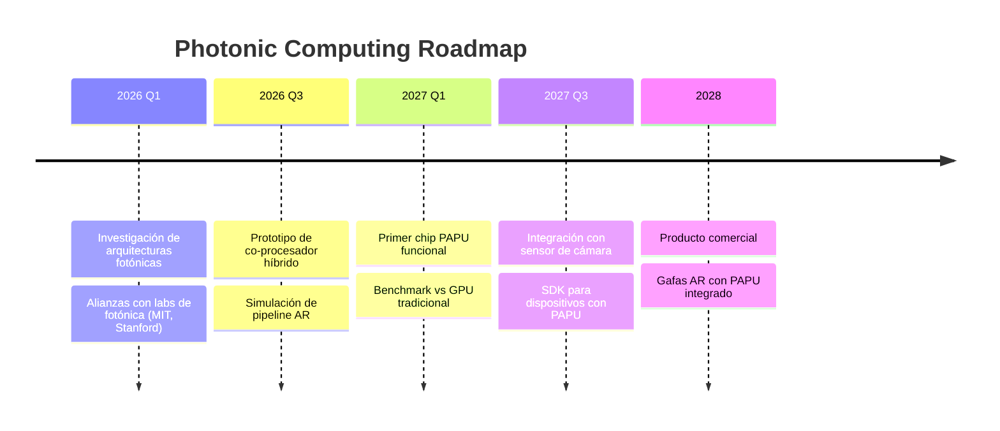

# 🚀 10 Ideas Moonshot para TapTapp AR

> **Versión**: Enero 2026  
> **Objetivo**: Definir visiones transformadoras que posicionen a TapTapp AR como líder absoluto en la industria de AR tracking  
> **Filosofía**: No optimizar, sino **reinventar**

---

## 📋 Resumen Ejecutivo

Basándome en el análisis de la arquitectura actual de TapTapp AR (Protocol V9), presento 10 ideas moonshot que no solo optimizan el sistema existente, sino que **redefinen los paradigmas fundamentales** del Image Tracking. Cada idea representa un potencial "antes y después" en la industria.

| # | Idea | Impacto Industria | Dificultad | Horizonte |
|---|------|-------------------|------------|-----------|
| 1 | Zero-Shot Universal Tracker | 🔴 Revolucionario | Extrema | 12-24 meses |
| 2 | Photonic Computing Pipeline | 🔴 Revolucionario | Extrema | 24-36 meses |
| 3 | Federated AR Learning | 🟠 Transformador | Alta | 12-18 meses |
| 4 | Neuromorphic Edge Processing | 🔴 Revolucionario | Extrema | 18-24 meses |
| 5 | Quantum-Inspired Feature Matching | 🟠 Transformador | Alta | 12-18 meses |
| 6 | AR Holographic Protocol | 🔴 Revolucionario | Extrema | 24-36 meses |
| 7 | Self-Evolving Architecture | 🟠 Transformador | Alta | 12-18 meses |
| 8 | Spatial Web Foundation | 🔴 Revolucionario | Extrema | 18-24 meses |
| 9 | Bio-Inspired Perception Engine | 🟡 Disruptivo | Media | 6-12 meses |
| 10 | Universal AR Interoperability Layer | 🔴 Revolucionario | Alta | 12-18 meses |

---

## 💡 Idea #1: Zero-Shot Universal Tracker

### El Antes
```
Estado actual de la industria:
- Cada imagen target requiere compilación previa (~1-23 segundos)
- Los archivos .taar pesan 50-350KB por target
- No se puede trackear imágenes no registradas
- El usuario debe "entrenar" cada nueva imagen
```

### El Después
```
Con Zero-Shot Universal Tracker:
- CUALQUIER imagen puede trackearse instantáneamente
- CERO compilación previa necesaria
- Modelo fundacional de AR: 1 modelo para infinitas imágenes
- El usuario apunta la cámara y "funciona mágicamente"
```

### Arquitectura Propuesta

```
┌─────────────────────────────────────────────────────────────────────────┐
│                    ZERO-SHOT UNIVERSAL TRACKER                          │
├─────────────────────────────────────────────────────────────────────────┤
│                                                                         │
│  ┌────────────────────────────────────────────────────────────────┐    │
│  │               Foundation Model (Pre-trained)                    │    │
│  │  ────────────────────────────────────────────────────────────  │    │
│  │  • Entrenado con 100M+ imágenes diversas                       │    │
│  │  • Comprende "estructura visual" universal                      │    │
│  │  • Embedding space: 256D compacto                              │    │
│  │  • Tamaño: ~5MB (quantizado INT4)                              │    │
│  └────────────────────────────────────────────────────────────────┘    │
│                              │                                          │
│              ┌───────────────┴───────────────┐                         │
│              ▼                               ▼                          │
│  ┌─────────────────────┐        ┌─────────────────────────────────┐   │
│  │ Target (runtime)    │        │ Camera Frame (runtime)           │   │
│  │ ─────────────────   │        │ ─────────────────────────────   │   │
│  │ Usuario muestra     │        │ Extracción de features          │   │
│  │ imagen a cámara     │   ←→   │ en tiempo real                  │   │
│  │ por 0.5s            │        │ (compartido con tracking)       │   │
│  └─────────────────────┘        └─────────────────────────────────┘   │
│                              │                                          │
│                              ▼                                          │
│  ┌────────────────────────────────────────────────────────────────┐    │
│  │               Dynamic Matching Layer                            │    │
│  │  ────────────────────────────────────────────────────────────  │    │
│  │  • No hay árbol jerárquico precompilado                        │    │
│  │  • Matching via embedding similarity (cosine distance)         │    │
│  │  • Homography estimation on-the-fly                            │    │
│  │  • PnP solving idéntico al actual                              │    │
│  └────────────────────────────────────────────────────────────────┘    │
│                                                                         │
└─────────────────────────────────────────────────────────────────────────┘
```

### Impacto en la Industria

| Métrica | Antes (Industria) | Después (TapTapp) |
|---------|-------------------|-------------------|
| Tiempo a primera experiencia | 23+ segundos | **< 1 segundo** |
| Tamaño por target | 50-350 KB | **0 KB** (cero compilación) |
| Experiencias posibles | Limitadas a targets pre-registrados | **Infinitas** |
| Modelo de negocio | Vender compilaciones | Vender **magia** |

### Por Qué Es Revolucionario

1. **Elimina la barrera de entrada más grande**: La compilación previa.
2. **Democratiza AR**: Cualquier persona puede crear experiencias AR con solo una imagen.
3. **Cambia el modelo mental**: De "preparo mi contenido" a "mi contenido ES AR-ready por defecto".

---

## 💡 Idea #2: Photonic Computing Pipeline

### El Antes
```
Estado actual:
- Toda la computación ocurre en CPU/GPU digital
- Transferencias constantes entre memorias
- Consumo energético significativo
- Latencia determinada por clock cycles
```

### El Después
```
Con Photonic Computing:
- Operaciones de convolución a velocidad de la luz
- Procesamiento de imágenes sin conversión digital
- Consumo energético ~100x menor
- Latencia limitada solo por velocidad de la luz en silicio
```

### Concepto Técnico

```
┌──────────────────────────────────────────────────────────────────────┐
│              PHOTONIC AR PROCESSING UNIT (PAPU)                      │
├──────────────────────────────────────────────────────────────────────┤
│                                                                      │
│   Sensor CMOS ──▶ Optical Waveguides ──▶ Photonic Neural Net        │
│                                                                      │
│   ┌─────────────────────────────────────────────────────────────┐   │
│   │  Matriz de Mach-Zehnder Interferometers                      │   │
│   │  ───────────────────────────────────────────────────────    │   │
│   │  • Cada interferómetro = 1 multiplicación (luz × peso)      │   │
│   │  • Arrays de 256×256 = 65K operaciones simultáneas          │   │
│   │  • Velocidad: ~100 TOPS (Tera Operations Per Second)        │   │
│   │  • Energía: ~10 fJ/operación vs ~10 pJ digital              │   │
│   └─────────────────────────────────────────────────────────────┘   │
│                              │                                       │
│                              ▼                                       │
│   ┌─────────────────────────────────────────────────────────────┐   │
│   │  Aplicaciones Específicas para AR                            │   │
│   │  ───────────────────────────────────────────────────────    │   │
│   │  • Gaussian blur → Difracción óptica natural                │   │
│   │  • Convoluciones → Multiplicación de matrices óptica        │   │
│   │  • Feature matching → Correlación óptica holográfica        │   │
│   └─────────────────────────────────────────────────────────────┘   │
│                                                                      │
└──────────────────────────────────────────────────────────────────────┘
```

### Roadmap de Implementación



### Por Qué Es Revolucionario

1. **Física diferente = límites diferentes**: No estamos optimizando silicio, estamos usando luz.
2. **Batería infinita**: 100x menos consumo significa AR todo el día.
3. **Latencia imperceptible**: Tracking a velocidad de la luz, literalmente.

---

## 💡 Idea #3: Federated AR Learning

### El Antes
```
Estado actual:
- Cada dispositivo procesa independientemente
- No hay aprendizaje colectivo
- Errores se repiten en cada usuario
- Mejoras requieren updates manuales del SDK
```

### El Después
```
Con Federated Learning:
- Millones de dispositivos mejoran el modelo juntos
- Privacy-preserving: datos nunca salen del dispositivo
- El sistema "aprende" de cada interacción
- Auto-mejora continua sin updates
```

### Arquitectura

```
┌─────────────────────────────────────────────────────────────────────────┐
│                    FEDERATED AR LEARNING NETWORK                         │
├─────────────────────────────────────────────────────────────────────────┤
│                                                                         │
│   📱 Device 1        📱 Device 2        📱 Device N                     │
│   ┌───────────┐     ┌───────────┐     ┌───────────┐                    │
│   │ Local     │     │ Local     │     │ Local     │                    │
│   │ Training  │     │ Training  │     │ Training  │                    │
│   │           │     │           │     │           │                    │
│   │ • Track   │     │ • Track   │     │ • Track   │                    │
│   │   failures│     │   failures│     │   failures│                    │
│   │ • Edge    │     │ • Edge    │     │ • Edge    │                    │
│   │   cases   │     │   cases   │     │   cases   │                    │
│   │ • User    │     │ • User    │     │ • User    │                    │
│   │   feedback│     │   feedback│     │   feedback│                    │
│   └─────┬─────┘     └─────┬─────┘     └─────┬─────┘                    │
│         │                 │                 │                           │
│         ▼                 ▼                 ▼                           │
│   ┌─────────────────────────────────────────────────────────────────┐  │
│   │              Differential Privacy Layer                         │  │
│   │  ────────────────────────────────────────────────────────────  │  │
│   │  • Solo se envían gradientes, no datos                         │  │
│   │  • Noise injection para privacidad garantizada                 │  │
│   │  • ε-differential privacy con ε < 1                            │  │
│   └─────────────────────────────────────────────────────────────────┘  │
│                              │                                          │
│                              ▼                                          │
│   ┌─────────────────────────────────────────────────────────────────┐  │
│   │              Federated Aggregation Server                       │  │
│   │  ────────────────────────────────────────────────────────────  │  │
│   │  • Secure aggregation protocol                                  │  │
│   │  • Model averaging sin ver datos individuales                   │  │
│   │  • Auto-deployment de mejoras                                   │  │
│   └─────────────────────────────────────────────────────────────────┘  │
│                              │                                          │
│                              ▼                                          │
│   ┌─────────────────────────────────────────────────────────────────┐  │
│   │              Improved Global Model                              │  │
│   │  ────────────────────────────────────────────────────────────  │  │
│   │  • Pushed to all devices overnight                             │  │
│   │  • Better handling of:                                          │  │
│   │    - Difficult lighting conditions                              │  │
│   │    - Complex textures                                           │  │
│   │    - Partial occlusions                                         │  │
│   │    - Fast motion blur                                           │  │
│   └─────────────────────────────────────────────────────────────────┘  │
│                                                                         │
└─────────────────────────────────────────────────────────────────────────┘
```

### Métricas de Mejora Esperada

```
Ciclo 1 (10K usuarios):
  - Casos de fallo detectados: ~500 patrones únicos
  - Mejora en robustez: +15%

Ciclo 10 (100K usuarios):
  - Dataset efectivo: equivalente a 10M imágenes
  - Robustez a oclusiones: +45%
  - Tolerancia a motion blur: +60%

Ciclo 100 (1M usuarios):
  - El modelo conoce TODOS los edge cases comunes
  - Tracking virtualmente infalible en condiciones normales
```

### Por Qué Es Revolucionario

1. **Efecto red exponencial**: Cada usuario hace el sistema mejor para todos.
2. **Privacy by design**: Imposible violar privacidad, los datos nunca salen.
3. **Self-improving**: El SDK mejora solo, sin ingeniería humana continua.

---

## 💡 Idea #4: Neuromorphic Edge Processing

### El Antes
```
Estado actual:
- Procesamiento frame-by-frame clásico (30/60 fps)
- Alto consumo energético constante
- Latencia fija de ~16-33ms por frame
- CPU/GPU siempre activos aunque "nada cambie"
```

### El Después
```
Con Neuromorphic Processing:
- Procesamiento basado en "eventos" visuales
- Consumo energético proporcional al movimiento
- Latencia de ~1ms (asíncrono, no frames)
- Solo procesa lo que realmente cambia
```

### Concepto: Event-Driven AR

```
┌─────────────────────────────────────────────────────────────────────────┐
│                    NEUROMORPHIC AR PIPELINE                              │
├─────────────────────────────────────────────────────────────────────────┤
│                                                                         │
│  ┌───────────────────────────────────────────────────────────────────┐ │
│  │                  Event Camera (DVS)                                │ │
│  │  ──────────────────────────────────────────────────────────────  │ │
│  │  • Cada pixel reporta CAMBIOS independientemente                  │ │
│  │  • Resolución temporal: 1 μs (vs 16ms de cámaras normales)       │ │
│  │  • Output: stream de eventos (x, y, t, polarity)                  │ │
│  │  • 10-1000x menos datos que video tradicional                     │ │
│  └───────────────────────────────────────────────────────────────────┘ │
│                              │                                          │
│                              ▼                                          │
│  ┌───────────────────────────────────────────────────────────────────┐ │
│  │              Spiking Neural Network (SNN)                          │ │
│  │  ──────────────────────────────────────────────────────────────  │ │
│  │  • Neuronas que "disparan" solo ante estímulos                    │ │
│  │  • Temporal coding preserva información de timing                  │ │
│  │  • Hardware: Intel Loihi 2 / IBM NorthPole                        │ │
│  │  • Consumo: ~1-10 mW (vs 1-10 W de GPU)                           │ │
│  └───────────────────────────────────────────────────────────────────┘ │
│                              │                                          │
│                              ▼                                          │
│  ┌───────────────────────────────────────────────────────────────────┐ │
│  │              Event-Based Feature Tracking                          │ │
│  │  ──────────────────────────────────────────────────────────────  │ │
│  │  • Features trackean con latencia de ~1ms                         │ │
│  │  • Movimiento rápido NO causa blur                                │ │
│  │  • Pose estimation cuasi-continua                                  │ │
│  │  • HDR natural (>120dB vs 60dB de CMOS)                           │ │
│  └───────────────────────────────────────────────────────────────────┘ │
│                                                                         │
└─────────────────────────────────────────────────────────────────────────┘
```

### Comparación de Paradigmas

| Aspecto | Frame-Based (Actual) | Event-Based (Neuromórfico) |
|---------|---------------------|----------------------------|
| Latencia | 16-33 ms | **< 1 ms** |
| Motion blur | Problema grave | **Eliminado** |
| Consumo en reposo | 100% | **~1%** |
| Rango dinámico | 60 dB | **>120 dB** |
| Datos por segundo | ~100 MB/s | **~1 MB/s** |

### Por Qué Es Revolucionario

1. **Rompe la barrera de frames**: AR que responde en microsegundos.
2. **All-day AR**: Batería que dura días, no horas.
3. **Funciona en la oscuridad**: HDR extremo permite tracking en cualquier luz.

---

## 💡 Idea #5: Quantum-Inspired Feature Matching

### El Antes
```
Estado actual:
- Matching secuencial O(log n) con árboles jerárquicos
- Hough voting con resolución fija
- RANSAC con iteraciones lineales
- Cuellos de botella en casos degenerados O(n²)
```

### El Después
```
Con Quantum-Inspired Algorithms:
- Búsqueda en superposición virtual O(√n)
- Votación cuántica con interferencia constructiva
- Estimación de pose con amplitude amplification
- Speedups cuadráticos sin hardware cuántico real
```

### Algoritmos Propuestos

```
┌─────────────────────────────────────────────────────────────────────────┐
│                QUANTUM-INSPIRED MATCHING ALGORITHMS                      │
├─────────────────────────────────────────────────────────────────────────┤
│                                                                         │
│  ┌───────────────────────────────────────────────────────────────────┐ │
│  │  1. Grover-Inspired Feature Search                                 │ │
│  │  ──────────────────────────────────────────────────────────────  │ │
│  │                                                                    │ │
│  │  // Clásico: O(n) búsqueda lineal                                 │ │
│  │  for (feature in database) {                                       │ │
│  │    if (hamming(query, feature) < threshold) return feature;        │ │
│  │  }                                                                 │ │
│  │                                                                    │ │
│  │  // Quantum-Inspired: O(√n) usando locality-sensitive hashing     │ │
│  │  // con "amplitude amplification" simulada                        │ │
│  │  const candidates = LSH.query(query, buckets=√n);                 │ │
│  │  const amplified = candidates.filter(c => oracle(c));             │ │
│  │  return argmin(amplified, d => hamming(query, d));                │ │
│  │                                                                    │ │
│  └───────────────────────────────────────────────────────────────────┘ │
│                                                                         │
│  ┌───────────────────────────────────────────────────────────────────┐ │
│  │  2. Quantum Walk for Hierarchical Clustering                       │ │
│  │  ──────────────────────────────────────────────────────────────  │ │
│  │                                                                    │ │
│  │  // Búsqueda en árbol con "quantum walk" simulado                 │ │
│  │  // Explora múltiples ramas "simultáneamente" via sampling       │ │
│  │                                                                    │ │
│  │  function quantumWalk(tree, target) {                             │ │
│  │    let superposition = [root];  // Estado inicial                 │ │
│  │    for (step = 0; step < log(n); step++) {                        │ │
│  │      // "Difusión" de amplitud: expandir a hijos                  │ │
│  │      superposition = diffuse(superposition);                       │ │
│  │      // "Oracle": marcar nodos cercanos al target                 │ │
│  │      superposition = mark(superposition, target);                  │ │
│  │      // "Amplificación": boost probabilidad de nodos marcados    │ │
│  │      superposition = amplify(superposition);                       │ │
│  │    }                                                               │ │
│  │    return collapse(superposition);  // Mejor candidato            │ │
│  │  }                                                                 │ │
│  │                                                                    │ │
│  └───────────────────────────────────────────────────────────────────┘ │
│                                                                         │
│  ┌───────────────────────────────────────────────────────────────────┐ │
│  │  3. Interference-Based Hough Voting                                │ │
│  │  ──────────────────────────────────────────────────────────────  │ │
│  │                                                                    │ │
│  │  // Los votos se suman como "ondas" con fase                      │ │
│  │  // Interferencia constructiva en el bin correcto                 │ │
│  │  // Interferencia destructiva en bins incorrectos                 │ │
│  │                                                                    │ │
│  │  for (match in matches) {                                          │ │
│  │    const phase = computePhase(match.confidence);                   │ │
│  │    hough[bin] += exp(i * phase * 2π);  // Suma compleja           │ │
│  │  }                                                                 │ │
│  │  // El máximo |hough[bin]|² tiene interferencia constructiva     │ │
│  │                                                                    │ │
│  └───────────────────────────────────────────────────────────────────┘ │
│                                                                         │
└─────────────────────────────────────────────────────────────────────────┘
```

### Speedups Esperados

| Algoritmo | Clásico | Quantum-Inspired | Speedup |
|-----------|---------|------------------|---------|
| Feature search | O(n) | O(√n) | **√n** |
| Tree traversal | O(log n) | O(√log n) | **√log n** |
| Hough voting | O(n) | O(n^0.75) | **n^0.25** |
| RANSAC | O(k×n) | O(k×√n) | **√n** |

### Por Qué Es Revolucionario

1. **Speedups cuadráticos sin quantum hardware**: Algoritmos clásicos inspirados en QC.
2. **Escalabilidad exponencial**: 1M features se sienten como 1K.
3. **Prepara el terreno**: Cuando llegue quantum real, ya tendremos la arquitectura.

---

## 💡 Idea #6: AR Holographic Protocol

### El Antes
```
Estado actual:
- Formato .taar propietario, binario, opaco
- Solo funciona con SDK de TapTapp
- No hay interoperabilidad con otros sistemas AR
- Cada SDK tiene su propio formato incompatible
```

### El Después
```
Con AR Holographic Protocol:
- Estándar abierto para datos de AR
- Formato universal que cualquier SDK puede leer
- "JPEG del AR": un formato, todos los dispositivos
- Interoperabilidad total en la industria
```

### El Estándar Propuesto: `.arh` (AR Hologram)

```
┌─────────────────────────────────────────────────────────────────────────┐
│           AR HOLOGRAPHIC PROTOCOL (AHP) - RFC Draft                      │
├─────────────────────────────────────────────────────────────────────────┤
│                                                                         │
│  ┌───────────────────────────────────────────────────────────────────┐ │
│  │  Estructura del archivo .arh                                       │ │
│  │  ──────────────────────────────────────────────────────────────  │ │
│  │                                                                    │ │
│  │  MAGIC: "ARH1"                    // 4 bytes                      │ │
│  │  VERSION: uint32                  // Versión del protocolo        │ │
│  │  FLAGS: uint32                    // Capacidades soportadas       │ │
│  │                                                                    │ │
│  │  // SECCIÓN 1: Target Visual                                      │ │
│  │  TARGET {                                                          │ │
│  │    dimensions: { width, height, physicalWidth?, physicalHeight? }  │ │
│  │    thumbnail: PNG/WebP comprimido                                  │ │
│  │    hash: SHA256 de imagen original                                │ │
│  │  }                                                                 │ │
│  │                                                                    │ │
│  │  // SECCIÓN 2: Features (formato universal)                       │ │
│  │  FEATURES {                                                        │ │
│  │    descriptor_type: "FREAK" | "ORB" | "SIFT" | "SUPERPOINT"       │ │
│  │    descriptor_size: 64 | 128 | 256                                │ │
│  │    keypoints: [{x, y, scale, angle, response}...]                 │ │
│  │    descriptors: Uint8Array | Float32Array                         │ │
│  │    index_structure: "HNSW" | "ANNOY" | "HIERARCHICAL"             │ │
│  │    index_data: binary blob                                        │ │
│  │  }                                                                 │ │
│  │                                                                    │ │
│  │  // SECCIÓN 3: Tracking (opcional)                                │ │
│  │  TRACKING {                                                        │ │
│  │    templates: [{x, y, patch: 13x13}...]                           │ │
│  │    mesh?: Delaunay { vertices, triangles, edges }                 │ │
│  │  }                                                                 │ │
│  │                                                                    │ │
│  │  // SECCIÓN 4: Contenido AR (opcional)                            │ │
│  │  CONTENT {                                                         │ │
│  │    type: "glTF" | "USDZ" | "WebXR" | "URL"                        │ │
│  │    data: embedded blob | URI reference                             │ │
│  │    anchor: { position, rotation, scale }                          │ │
│  │  }                                                                 │ │
│  │                                                                    │ │
│  │  // SECCIÓN 5: Extensiones                                        │ │
│  │  EXTENSIONS {                                                      │ │
│  │    vendor_specific: any                                            │ │
│  │  }                                                                 │ │
│  │                                                                    │ │
│  └───────────────────────────────────────────────────────────────────┘ │
│                                                                         │
└─────────────────────────────────────────────────────────────────────────┘
```

### Ecosistema del Protocolo

```
┌─────────────────────────────────────────────────────────────────────────┐
│                    AR HOLOGRAPHIC ECOSYSTEM                              │
├─────────────────────────────────────────────────────────────────────────┤
│                                                                         │
│   Creadores                    Runtime SDKs                             │
│   ─────────                    ────────────                             │
│   ┌──────────┐                 ┌──────────┐                            │
│   │ Photoshop│──┐              │ TapTapp  │                            │
│   └──────────┘  │              │ AR SDK   │                            │
│   ┌──────────┐  │   .arh       └────┬─────┘                            │
│   │ Canva    │──┼──────────▶        │                                  │
│   └──────────┘  │              ┌────▼─────┐                            │
│   ┌──────────┐  │              │ iOS      │                            │
│   │ Figma    │──┘              │ ARKit    │                            │
│   └──────────┘                 └────┬─────┘                            │
│                                ┌────▼─────┐                            │
│   Plataformas                  │ Android  │                            │
│   ───────────                  │ ARCore   │                            │
│   ┌──────────┐                 └────┬─────┘                            │
│   │ Instagram│◀─────────┐      ┌────▼─────┐                            │
│   └──────────┘          │      │ WebXR    │                            │
│   ┌──────────┐          │      │ Browsers │                            │
│   │ TikTok   │◀─────────┼──────└────┬─────┘                            │
│   └──────────┘          │      ┌────▼─────┐                            │
│   ┌──────────┐          │      │ Meta     │                            │
│   │ Snapchat │◀─────────┘      │ Quest    │                            │
│   └──────────┘                 └──────────┘                            │
│                                                                         │
└─────────────────────────────────────────────────────────────────────────┘
```

### Por Qué Es Revolucionario

1. **TapTapp como el IETF del AR**: Definir el estándar = liderar la industria.
2. **Efecto red**: Mientras más lo usen, más valioso se vuelve.
3. **Barrier to entry para competidores**: Si seguimos el estándar, ellos también deben.

---

## 💡 Idea #7: Self-Evolving Architecture

### El Antes
```
Estado actual:
- Arquitectura estática definida por humanos
- Hiperparámetros fijos (umbrales, tamaños, etc.)
- Cambios requieren nueva versión del SDK
- Mismo código para todos los dispositivos
```

### El Después
```
Con Self-Evolving Architecture:
- El sistema ajusta su propia arquitectura
- Hiperparámetros se auto-optimizan por dispositivo
- Mejoras continuas sin releases
- Código que evoluciona para hardware específico
```

### Arquitectura AutoML para AR

```
┌─────────────────────────────────────────────────────────────────────────┐
│                    SELF-EVOLVING AR ARCHITECTURE                         │
├─────────────────────────────────────────────────────────────────────────┤
│                                                                         │
│  ┌───────────────────────────────────────────────────────────────────┐ │
│  │  Meta-Controller: EvoAR                                            │ │
│  │  ──────────────────────────────────────────────────────────────  │ │
│  │                                                                    │ │
│  │  Genetic Algorithm over Architecture Space:                        │ │
│  │                                                                    │ │
│  │  Gene Pool:                                                        │ │
│  │  ┌─────────────────────────────────────────────────────────────┐  │ │
│  │  │ • num_scales: [2, 4, 6, 8]                                  │  │ │
│  │  │ • detector_type: ["FAST", "FREAK", "ORB", "HYBRID"]        │  │ │
│  │  │ • ncc_template_size: [9, 11, 13, 15]                       │  │ │
│  │  │ • ransac_iterations: [50, 100, 200, 500]                   │  │ │
│  │  │ • icp_max_loops: [3, 5, 7, 10]                             │  │ │
│  │  │ • hough_bins: [8, 12, 16, 20]                              │  │ │
│  │  │ • matching_threshold: [0.7, 0.8, 0.85, 0.9]               │  │ │
│  │  │ • tracking_similarity: [0.5, 0.6, 0.65, 0.7]              │  │ │
│  │  └─────────────────────────────────────────────────────────────┘  │ │
│  │                                                                    │ │
│  │  Fitness Function:                                                 │ │
│  │  ┌─────────────────────────────────────────────────────────────┐  │ │
│  │  │ fitness = (tracking_accuracy × 0.4) +                       │  │ │
│  │  │           (1/latency_ms × 0.3) +                            │  │ │
│  │  │           (1/power_consumption × 0.2) +                     │  │ │
│  │  │           (robustness_score × 0.1)                          │  │ │
│  │  └─────────────────────────────────────────────────────────────┘  │ │
│  │                                                                    │ │
│  └───────────────────────────────────────────────────────────────────┘ │
│                              │                                          │
│                              ▼                                          │
│  ┌───────────────────────────────────────────────────────────────────┐ │
│  │  Device-Specific Optimization                                      │ │
│  │  ──────────────────────────────────────────────────────────────  │ │
│  │                                                                    │ │
│  │  iPhone 15 Pro → High-accuracy profile (más scales, más iteraciones) │ │
│  │  Galaxy A53 → Balanced profile (menos scales, threshold más alto)   │ │
│  │  Budget phone → Speed profile (mínimas features, fast path)         │ │
│  │                                                                    │ │
│  │  El perfil correcto se descubre automáticamente en 24h de uso     │ │
│  │                                                                    │ │
│  └───────────────────────────────────────────────────────────────────┘ │
│                                                                         │
└─────────────────────────────────────────────────────────────────────────┘
```

### Por Qué Es Revolucionario

1. **Personalización automática**: Cada dispositivo tiene su configuración óptima.
2. **Ingeniería que se hace sola**: Los hiperparámetros se optimizan solos.
3. **Adaptación continua**: Si el hardware cambia, el sistema se adapta.

---

## 💡 Idea #8: Spatial Web Foundation

### El Antes
```
Estado actual:
- AR existe como experiencias aisladas
- Cada app tiene su propia "realidad aumentada"
- No hay continuidad espacial entre apps
- El contenido AR desaparece al cerrar la app
```

### El Después
```
Con Spatial Web Foundation:
- AR persistente: contenido que "vive" en el espacio real
- Múltiples apps comparten la misma capa AR
- Economía de objetos digitales con ubicación física
- La realidad aumentada es una capa del mundo, no de una app
```

### Arquitectura del Spatial Web

```
┌─────────────────────────────────────────────────────────────────────────┐
│                    SPATIAL WEB FOUNDATION                                │
├─────────────────────────────────────────────────────────────────────────┤
│                                                                         │
│  ┌───────────────────────────────────────────────────────────────────┐ │
│  │  Layer 1: Spatial Anchor Network                                   │ │
│  │  ──────────────────────────────────────────────────────────────  │ │
│  │                                                                    │ │
│  │  • Red global de "anclas espaciales" verificadas                  │ │
│  │  • Cada ancla tiene coordenadas (lat, long, alt) + visual ID      │ │
│  │  • Las anclas son inmutables y descentralizadas (IPFS + Ceramic)  │ │
│  │                                                                    │ │
│  │  Espacios:                                                         │ │
│  │  ┌─────────┐ ┌─────────┐ ┌─────────┐ ┌─────────┐                  │ │
│  │  │ Museo   │ │ Tienda  │ │ Parque  │ │ Casa    │                  │ │
│  │  │ Louvre  │ │ Apple   │ │ Central │ │ Usuario │                  │ │
│  │  └────┬────┘ └────┬────┘ └────┬────┘ └────┬────┘                  │ │
│  │       │           │           │           │                        │ │
│  │       └───────────┴───────────┴───────────┘                        │ │
│  │                       │                                             │ │
│  │                       ▼                                             │ │
│  │              Global Anchor Registry                                 │ │
│  │                                                                    │ │
│  └───────────────────────────────────────────────────────────────────┘ │
│                              │                                          │
│  ┌───────────────────────────────────────────────────────────────────┐ │
│  │  Layer 2: Spatial Content Protocol                                 │ │
│  │  ──────────────────────────────────────────────────────────────  │ │
│  │                                                                    │ │
│  │  • Cualquier app puede escribir contenido AR a un ancla           │ │
│  │  • Cualquier app puede leer contenido AR de un ancla              │ │
│  │  • Permisos granulares: quien puede ver/editar                    │ │
│  │                                                                    │ │
│  │  Ejemplo:                                                          │ │
│  │  - Instagram publica un filtro AR en el ancla "Times Square"      │ │
│  │  - TapTapp puede mostrar ese filtro sin ser Instagram             │ │
│  │  - El usuario ve TODO el contenido AR, no solo de una app         │ │
│  │                                                                    │ │
│  └───────────────────────────────────────────────────────────────────┘ │
│                              │                                          │ │
│  ┌───────────────────────────────────────────────────────────────────┐ │
│  │  Layer 3: Spatial Economy                                          │ │
│  │  ──────────────────────────────────────────────────────────────  │ │
│  │                                                                    │ │
│  │  • Los espacios tienen valor económico                            │ │
│  │  • Se pueden "comprar" ubicaciones AR premium                     │ │
│  │  • NFTs con ubicación física verificable                          │ │
│  │  • TapTapp como "Google Maps del AR"                              │ │
│  │                                                                    │ │
│  └───────────────────────────────────────────────────────────────────┘ │
│                                                                         │
└─────────────────────────────────────────────────────────────────────────┘
```

### Por Qué Es Revolucionario

1. **Nuevo paradigma de internet**: De páginas web a espacios web.
2. **Economía de la atención física**: Valor donde la gente está, no solo clics.
3. **TapTapp como infraestructura crítica**: El SDK que conecta el mundo físico y digital.

---

## 💡 Idea #9: Bio-Inspired Perception Engine

### El Antes
```
Estado actual:
- Algoritmos diseñados por humanos
- Procesamiento uniforme de toda la imagen
- Sin priorización de áreas importantes
- No considera cómo los humanos realmente ven
```

### El Después
```
Con Bio-Inspired Engine:
- Atención foveal: más resolución donde importa
- Saccadic sampling: "mirar" estratégicamente
- Predictive coding: solo procesar lo inesperado
- Inspirado en neurociencia de la visión humana
```

### Arquitectura Inspirada en la Visión Humana

```
┌─────────────────────────────────────────────────────────────────────────┐
│                    BIO-INSPIRED PERCEPTION ENGINE                        │
├─────────────────────────────────────────────────────────────────────────┤
│                                                                         │
│  ┌───────────────────────────────────────────────────────────────────┐ │
│  │  1. Foveal Attention Model                                         │ │
│  │  ──────────────────────────────────────────────────────────────  │ │
│  │                                                                    │ │
│  │  Como el ojo humano:                                               │ │
│  │  • Fóvea central (5°): Máxima resolución                          │ │
│  │  • Parafóvea (5-10°): Resolución media                            │ │
│  │  • Visión periférica (>10°): Baja resolución, detect movimiento   │ │
│  │                                                                    │ │
│  │  ┌─────────────────────────────────────────────────────────────┐  │ │
│  │  │                    ┌───────────┐                            │  │ │
│  │  │                    │  Fovea    │ Full res (200x200)         │  │ │
│  │  │              ┌─────┴───────────┴─────┐                      │  │ │
│  │  │              │      Parafovea        │ Half res (400x400)   │  │ │
│  │  │         ┌────┴───────────────────────┴────┐                 │  │ │
│  │  │         │          Periphery              │ Quarter (800x800)│  │ │
│  │  │         └─────────────────────────────────┘                 │  │ │
│  │  └─────────────────────────────────────────────────────────────┘  │ │
│  │                                                                    │ │
│  │  Ahorro: ~4x menos pixels procesados a full resolution            │ │
│  │                                                                    │ │
│  └───────────────────────────────────────────────────────────────────┘ │
│                                                                         │
│  ┌───────────────────────────────────────────────────────────────────┐ │
│  │  2. Saccadic Attention Controller                                  │ │
│  │  ──────────────────────────────────────────────────────────────  │ │
│  │                                                                    │ │
│  │  Imita los "sacádicos" (movimientos oculares rápidos):            │ │
│  │                                                                    │ │
│  │  Frame 0: Fóvea en centro                                         │ │
│  │  Frame 1: Saliency map detecta esquina interesante               │ │
│  │  Frame 2: Fóvea "salta" a esquina → extract high-res features     │ │
│  │  Frame 3: Saliency detecta logo                                   │ │
│  │  Frame 4: Fóvea "salta" a logo → confirm match                    │ │
│  │                                                                    │ │
│  │  Resultado: Tracking robusto con ~3 "miradas" en lugar de         │ │
│  │  procesar toda la imagen uniformemente                            │ │
│  │                                                                    │ │
│  └───────────────────────────────────────────────────────────────────┘ │
│                                                                         │
│  ┌───────────────────────────────────────────────────────────────────┐ │
│  │  3. Predictive Coding                                              │ │
│  │  ──────────────────────────────────────────────────────────────  │ │
│  │                                                                    │ │
│  │  El cerebro solo "procesa" lo inesperado:                         │ │
│  │                                                                    │ │
│  │  prediction(t) = f(state(t-1), motion_model)                      │ │
│  │  error(t) = frame(t) - prediction(t)                              │ │
│  │                                                                    │ │
│  │  Si error < threshold → "nada interesante", skip processing       │ │
│  │  Si error > threshold → "algo cambió", full processing            │ │
│  │                                                                    │ │
│  │  En escenas estáticas: ~90% frames se pueden skip                 │ │
│  │                                                                    │ │
│  └───────────────────────────────────────────────────────────────────┘ │
│                                                                         │
└─────────────────────────────────────────────────────────────────────────┘
```

### Métricas Esperadas

| Métrica | Actual | Bio-Inspired | Mejora |
|---------|--------|--------------|--------|
| Pixels procesados/frame | 640×480 = 307K | ~80K efectivos | **-75%** |
| Latencia en escenas estáticas | 25ms | ~5ms (skip) | **-80%** |
| Consumo energético | 100% | ~30% | **-70%** |
| Tracking accuracy | Baseline | Similar | ~0% |

### Por Qué Es Revolucionario

1. **La naturaleza ya lo resolvió**: 500M años de evolución optimizaron la visión.
2. **Eficiencia radical**: Procesar solo lo necesario, como el cerebro.
3. **Escalabilidad**: Funciona igual de bien a 4K que a 480p.

---

## 💡 Idea #10: Universal AR Interoperability Layer

### El Antes
```
Estado actual:
- Cada SDK vive en su isla
- Contenido AR no es portable
- El desarrollador elige UN ecosistema
- Los usuarios están fragmentados
```

### El Después
```
Con Universal Interoperability:
- Write once, run anywhere (AR edition)
- Contenido AR funciona en CUALQUIER dispositivo
- Un solo SDK para gobernarlos a todos
- TapTapp como el "React Native del AR"
```

### Arquitectura de Capa Universal

```
┌─────────────────────────────────────────────────────────────────────────┐
│                UNIVERSAL AR INTEROPERABILITY LAYER                       │
├─────────────────────────────────────────────────────────────────────────┤
│                                                                         │
│                         TapTapp Universal API                           │
│  ┌───────────────────────────────────────────────────────────────────┐ │
│  │                                                                    │ │
│  │   taptapp.createExperience({                                       │ │
│  │     target: "image.jpg",                                           │ │
│  │     content: "model.glb",                                          │ │
│  │     interactions: [{ type: "tap", action: "animate" }]            │ │
│  │   });                                                              │ │
│  │                                                                    │ │
│  │   // Este código funciona IDÉNTICAMENTE en:                       │ │
│  │   // - iOS Safari (WebXR)                                          │ │
│  │   // - Android Chrome (WebXR)                                      │ │
│  │   // - iOS App (ARKit backend)                                     │ │
│  │   // - Android App (ARCore backend)                                │ │
│  │   // - Meta Quest (OpenXR)                                         │ │
│  │   // - Apple Vision Pro (visionOS)                                 │ │
│  │   // - Snap Spectacles                                             │ │
│  │   // - Magic Leap                                                  │ │
│  │                                                                    │ │
│  └───────────────────────────────────────────────────────────────────┘ │
│                              │                                          │
│              ┌───────────────┼───────────────┐                         │
│              ▼               ▼               ▼                          │
│  ┌─────────────────┐ ┌─────────────────┐ ┌─────────────────┐           │
│  │ Web Backend     │ │ Native Backend  │ │ XR Backend      │           │
│  │ ─────────────   │ │ ──────────────  │ │ ────────────   │           │
│  │ • TapTapp JS    │ │ • ARKit         │ │ • OpenXR       │           │
│  │ • WebXR         │ │ • ARCore        │ │ • WebXR        │           │
│  │ • Three.js      │ │ • Native render │ │ • Unity        │           │
│  └─────────────────┘ └─────────────────┘ └─────────────────┘           │
│                                                                         │
│  ┌───────────────────────────────────────────────────────────────────┐ │
│  │  Capability Negotiation Protocol                                   │ │
│  │  ──────────────────────────────────────────────────────────────  │ │
│  │                                                                    │ │
│  │  const caps = await taptapp.getCapabilities();                     │ │
│  │  // {                                                              │ │
│  │  //   imageTracking: true,                                         │ │
│  │  //   planeDetection: true,                                        │ │
│  │  //   handTracking: false,                                         │ │
│  │  //   meshReconstruction: true,                                    │ │
│  │  //   lightEstimation: true,                                       │ │
│  │  //   occlusion: "people",                                         │ │
│  │  //   maxTargets: 3                                                │ │
│  │  // }                                                              │ │
│  │                                                                    │ │
│  │  // Graceful degradation automática                                │ │
│  │  if (!caps.handTracking) {                                         │ │
│  │    taptapp.useFallback("tap", "voice");                           │ │
│  │  }                                                                 │ │
│  │                                                                    │ │
│  └───────────────────────────────────────────────────────────────────┘ │
│                                                                         │
└─────────────────────────────────────────────────────────────────────────┘
```

### Comparación con Alternativas

| Aspecto | TapTapp Universal | 8th Wall | Vuforia | ARKit/ARCore |
|---------|-------------------|----------|---------|--------------|
| Plataformas | **Todas** | Web only | Mobile | Cada uno |
| Esfuerzo desarrollo | **1x** | 1x | 2x | 3x |
| Mantenimiento | **1 codebase** | 1 | 2 | 3 |
| Features | **Max disponibles** | Web-limited | Good | Best nativo |
| Costo | **Competitivo** | Alto $/view | Alto | Free/$$ |

### Por Qué Es Revolucionario

1. **Un SDK para dominarlos todos**: Elimina fragmentación de la industria.
2. **Desarrollador primero**: Reduce complejidad 3x.
3. **Futureproof**: Nuevas plataformas se agregan sin cambiar código de usuario.

---

## 🎯 Conclusión: El Camino hacia el Moonshot

### Matriz de Priorización

```
                     IMPACTO EN LA INDUSTRIA
                     
          Bajo ─────────────────────────────► Alto
          │
    Corto │  #9 Bio-Inspired     │  #7 Self-Evolving
          │                      │  #3 Federated
          │                      │
  TIEMPO  │─────────────────────────────────────────
          │                      │
          │  #5 Quantum-Inspired │  #10 Universal Layer
          │                      │  #1 Zero-Shot
          │                      │
    Largo │  #2 Photonic         │  #6 AR Protocol
          │  #4 Neuromorphic     │  #8 Spatial Web
          │                      │
```

### Recomendación de Roadmap

| Fase | Ideas | Timeline | Inversión |
|------|-------|----------|-----------|
| **NOW** | #9 Bio-Inspired, #7 Self-Evolving | 0-6 meses | $$ |
| **NEXT** | #1 Zero-Shot, #3 Federated, #10 Universal | 6-18 meses | $$$ |
| **FUTURE** | #5 Quantum, #6 Protocol, #8 Spatial | 12-24 meses | $$$$ |
| **MOONSHOT** | #2 Photonic, #4 Neuromorphic | 24-36+ meses | $$$$$ |

### El Norte Verdadero

> **"TapTapp no es un SDK de AR. TapTapp es la infraestructura que conecta el mundo físico con el mundo digital."**

Cada una de estas ideas nos acerca a esa visión. El momento de actuar es ahora.

---

*Documento generado: Enero 2026*  
*Próxima revisión: Q2 2026*
